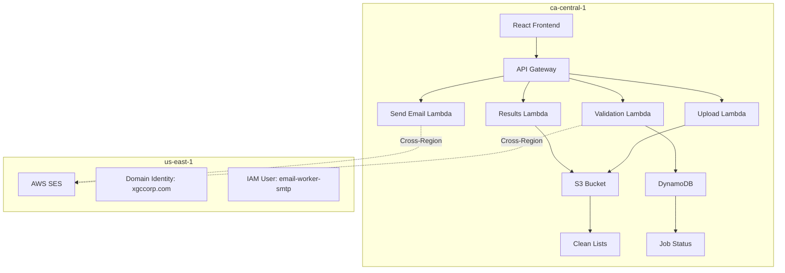

# Email Validation Service Design Document

## Overview

The Email Validation Service is a serverless web application built on AWS that validates email addresses from HubSpot exports, identifies bouncing emails, and provides clean contact lists for marketing campaigns. The system uses a microservices architecture with AWS Lambda functions, SES for email validation, and a React-based frontend for user interaction.

## Architecture

The system follows a hybrid serverless architecture pattern deployed across two AWS regions:

**Primary Region (ca-central-1):**
- **Frontend**: React-based web application hosted on AWS S3/CloudFront
- **API Gateway**: RESTful API endpoints for file upload, validation, and results
- **Lambda Functions**: Serverless compute for processing and validation logic
- **S3 Storage**: Temporary storage for uploaded files and processed results
- **DynamoDB**: Tracking validation jobs and results metadata

**SES Region (us-east-1):**
- **SES Integration**: Email validation and sending capabilities using existing setup
- **Domain Identity**: xgccorp.com (arn:aws:ses:us-east-1:010438486646:identity/xgccorp.com)
- **IAM User**: email-worker-smtp for SMTP authentication

### High-Level Architecture Flow



## Components and Interfaces

### Frontend Components

**FileUploadComponent**
- Handles CSV file selection and upload
- Validates file format and size before upload
- Displays upload progress and validation status
- Interface: `uploadFile(file: File) => Promise<UploadResponse>`

**ValidationDashboard**
- Shows real-time validation progress
- Displays validation statistics and results
- Provides download links for clean and rejected lists
- Interface: `getValidationStatus(jobId: string) => Promise<ValidationStatus>`

**EmailSenderComponent**
- Allows template upload and email composition
- Manages email sending to validated contacts
- Shows sending progress and delivery statistics
- Interface: `sendEmails(template: EmailTemplate, contacts: Contact[]) => Promise<SendResponse>`

### Backend Services

**FileProcessorService**
- Parses uploaded CSV files
- Extracts email addresses and contact metadata
- Validates file structure and required columns
- Interface: `processFile(s3Key: string) => Promise<ProcessedContacts>`

**EmailValidationService**
- Validates email addresses using AWS SES in us-east-1 region
- Implements batch processing for large lists
- Handles rate limiting and retry logic with cross-region considerations
- Interface: `validateEmails(emails: EmailAddress[]) => Promise<ValidationResults>`

**ResultsService**
- Generates clean and rejected contact lists
- Creates validation reports and statistics
- Manages file downloads and cleanup
- Interface: `generateResults(jobId: string) => Promise<ResultFiles>`

**EmailSendingService**
- Sends personalized emails using AWS SES in us-east-1 region
- Implements template substitution
- Manages sending quotas and throttling with cross-region calls
- Interface: `sendBulkEmails(template: EmailTemplate, contacts: Contact[]) => Promise<SendResults>`

## Data Models

### Contact Model
```typescript
interface Contact {
  recordId: string;
  firstName?: string;
  lastName?: string;
  email: string;
  company?: string;
  jobTitle?: string;
  phone?: string;
  metadata: Record<string, any>; // Additional HubSpot fields
}
```

### ValidationResult Model
```typescript
interface ValidationResult {
  email: string;
  isValid: boolean;
  bounceType?: 'hard' | 'soft' | 'complaint';
  bounceReason?: string;
  validatedAt: Date;
}
```

### ValidationJob Model
```typescript
interface ValidationJob {
  jobId: string;
  status: 'pending' | 'processing' | 'completed' | 'failed';
  totalContacts: number;
  processedContacts: number;
  validContacts: number;
  invalidContacts: number;
  createdAt: Date;
  completedAt?: Date;
  s3InputKey: string;
  s3OutputKeys?: {
    cleanList: string;
    rejectedList: string;
    report: string;
  };
}
```

### EmailTemplate Model
```typescript
interface EmailTemplate {
  subject: string;
  htmlBody: string;
  textBody?: string;
  placeholders: string[]; // e.g., ['firstName', 'company']
}
```

## Correctness Properties

*A property is a characteristic or behavior that should hold true across all valid executions of a system-essentially, a formal statement about what the system should do. Properties serve as the bridge between human-readable specifications and machine-verifiable correctness guarantees.*
Property 1: CSV parsing extracts all email addresses
*For any* valid CSV file with email columns, parsing should extract all email addresses along with their associated contact metadata
**Validates: Requirements 1.1**

Property 2: Invalid CSV files are rejected with error messages
*For any* malformed CSV file or file missing required email columns, the system should reject the upload and provide specific error messages
**Validates: Requirements 1.2**

Property 3: Successful upload returns correct contact count
*For any* successfully uploaded CSV file, the system should return the exact number of contacts found and initiate validation processing
**Validates: Requirements 1.3**

Property 4: Progress updates provided during processing
*For any* file being processed, the system should provide regular progress updates and completion estimates
**Validates: Requirements 1.4**

Property 5: Email validation attempts all addresses
*For any* list of email addresses, the validation process should attempt to validate each email using AWS SES
**Validates: Requirements 2.1**

Property 6: Failed validations are marked with reasons
*For any* email address that fails validation, it should be marked as invalid with the specific bounce reason recorded
**Validates: Requirements 2.2**

Property 7: Valid emails are retained in clean list
*For any* email address that passes validation, it should be marked as valid and included in the clean contact list
**Validates: Requirements 2.3**

Property 8: Rate limit handling with exponential backoff
*For any* validation process that encounters rate limits, the system should implement exponential backoff and retry mechanisms
**Validates: Requirements 2.4**

Property 9: Validation completion generates reports
*For any* completed validation job, a validation report should be generated with accurate success and failure statistics
**Validates: Requirements 2.5**

Property 10: Clean list generation in CSV format
*For any* completed validation process, a downloadable clean list should be available in CSV format
**Validates: Requirements 3.1**

Property 11: Clean list preserves original contact data
*For any* valid email address, all original contact metadata should be preserved in the clean list
**Validates: Requirements 3.2**

Property 12: Clean list excludes invalid emails
*For any* generated clean list, it should never contain email addresses marked as invalid or bouncing
**Validates: Requirements 3.3**

Property 13: CSV structure preservation
*For any* generated output CSV, it should maintain the same column structure and headers as the original input file
**Validates: Requirements 3.4**

Property 14: Statistics display accuracy
*For any* completed validation job, the displayed statistics should accurately reflect the total processed, valid, and invalid email counts
**Validates: Requirements 4.1**

Property 15: Bounce reason categorization
*For any* invalid email addresses, bounce reasons should be properly categorized by type (hard bounce, soft bounce, invalid format)
**Validates: Requirements 4.2**

Property 16: Download options availability
*For any* completed validation job, both clean and rejected contact lists should be available for download
**Validates: Requirements 4.3**

Property 17: Specific rejection reasons displayed
*For any* invalid email address, the specific reason for rejection should be displayed to the user
**Validates: Requirements 4.4**

Property 18: AWS SES integration for validation
*For any* email validation request, the system should use AWS SES for bounce testing and validation
**Validates: Requirements 5.1**

Property 19: Lambda function utilization
*For any* file upload and processing operation, AWS Lambda functions should be used for serverless compute
**Validates: Requirements 5.2**

Property 20: Temporary data cleanup
*For any* temporary data stored during processing, it should be automatically cleaned up after job completion
**Validates: Requirements 5.3**

Property 21: Progress updates during long operations
*For any* validation process taking extended time, real-time progress updates should be provided
**Validates: Requirements 6.2**

Property 22: Batch processing implementation
*For any* large contact list, the system should divide processing into configurable batch sizes
**Validates: Requirements 6.3**

Property 23: Error resilience during processing
*For any* validation errors encountered, the system should continue processing remaining contacts and report partial results
**Validates: Requirements 6.4**

Property 24: Resume capability after interruption
*For any* interrupted validation process, the system should allow resuming from the last successful validation point
**Validates: Requirements 6.5**

Property 25: Email sending to all valid contacts
*For any* email template and clean contact list, personalized emails should be sent to all valid contacts
**Validates: Requirements 7.1**

Property 26: SES usage for email sending
*For any* email sending operation, AWS SES should be used with proper sender authentication and reputation management
**Validates: Requirements 7.2**

Property 27: Template personalization with contact data
*For any* email template with placeholders, contact-specific data from the original export should be properly substituted
**Validates: Requirements 7.3**

Property 28: SES sending limits compliance
*For any* large volume email sending, the system should respect SES sending limits and implement appropriate throttling
**Validates: Requirements 7.4**

Property 29: Email sending error logging
*For any* failed email sending attempts, detailed error information should be logged and reported
**Validates: Requirements 7.5**

## Error Handling

The system implements comprehensive error handling across all components:

### File Processing Errors
- **Invalid File Format**: Clear error messages for unsupported file types or corrupted files
- **Missing Required Columns**: Specific guidance on required CSV structure
- **File Size Limits**: Graceful handling of oversized files with splitting suggestions

### Validation Errors
- **SES API Failures**: Retry logic with exponential backoff for temporary failures
- **Rate Limiting**: Automatic throttling and queue management
- **Network Issues**: Timeout handling and connection retry mechanisms

### Email Sending Errors
- **Bounce Handling**: Automatic suppression list management
- **Quota Exceeded**: Intelligent scheduling and rate limiting
- **Template Errors**: Validation of template syntax and placeholder substitution

### System Errors
- **Lambda Timeouts**: Automatic job resumption and state persistence
- **Storage Failures**: Redundant storage and automatic recovery
- **Authentication Issues**: Clear error messages and retry mechanisms

## Testing Strategy

The Email Validation Service will use a dual testing approach combining unit tests and property-based tests to ensure comprehensive coverage and correctness.

### Unit Testing Approach

Unit tests will focus on:
- Specific examples of CSV parsing with known good and bad inputs
- Integration points between Lambda functions and AWS services
- Error handling scenarios with mocked AWS service failures
- Template substitution with specific contact data examples
- File upload and download functionality with sample files

Unit tests provide concrete examples that demonstrate correct behavior and catch specific bugs in implementation details.

### Property-Based Testing Approach

Property-based tests will verify universal properties using **fast-check** (JavaScript/TypeScript property-based testing library). Each property-based test will run a minimum of 100 iterations to ensure thorough coverage of the input space.

Property-based tests will focus on:
- CSV parsing correctness across randomly generated valid and invalid files
- Email validation behavior across diverse email address formats
- Data preservation through the validation pipeline
- Statistics accuracy across various input distributions
- Template substitution correctness with random contact data

Each property-based test will be tagged with a comment explicitly referencing the correctness property from this design document using the format: **Feature: email-validation-service, Property {number}: {property_text}**

### Testing Requirements

- Configure each property-based test to run a minimum of 100 iterations
- Tag each property-based test with the corresponding design document property
- Implement exactly one property-based test per correctness property
- Use smart generators that constrain to valid input spaces
- Avoid mocking when possible to test real functionality
- Both unit tests and property tests are required and complement each other

The combination of unit tests (specific examples) and property tests (universal properties) provides comprehensive coverage: unit tests catch concrete bugs while property tests verify general correctness across all valid inputs.